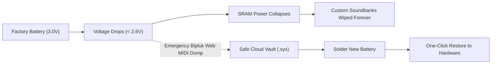
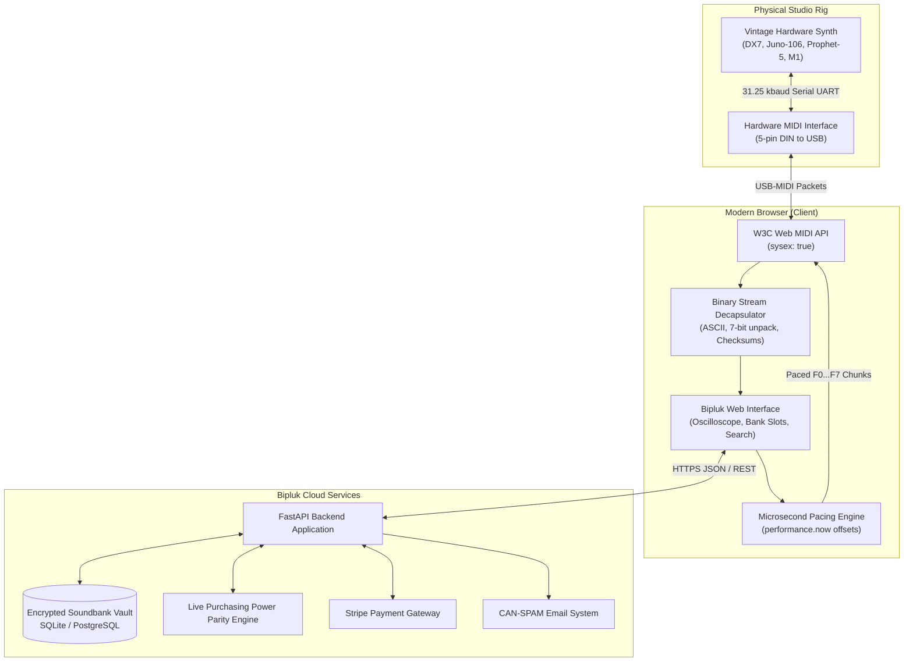
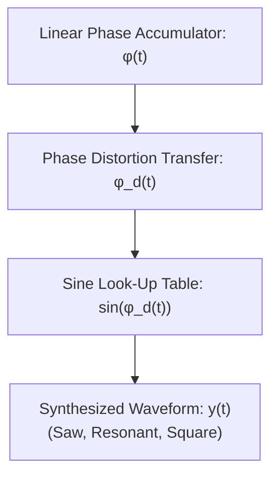
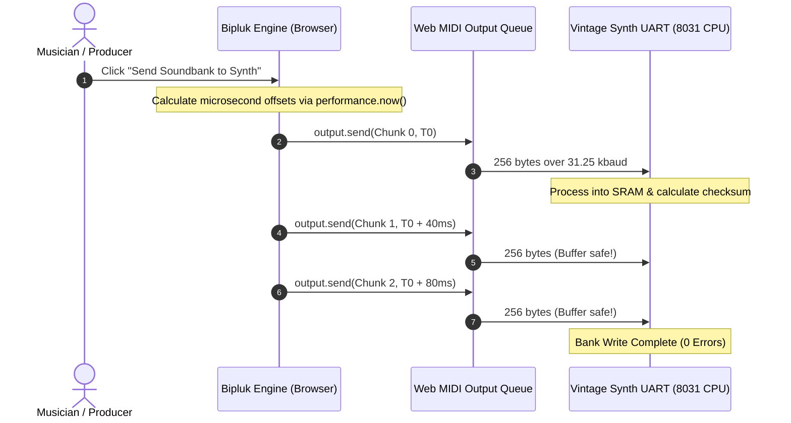

# Bipluk: Web MIDI SysEx Librarian & Vintage Hardware Synth Vault

<p align="center">
  
</p>

<p align="center">
  <strong>The open-source browser-native SysEx librarian, patch decapsulator, and cloud vault for vintage hardware synthesizers.</strong><br>
  <em>Zero software installation. Zero legacy 32-bit drivers. Sample-accurate Web MIDI packet pacing. 110+ synthesizers supported.</em>
</p>

<p align="center">
  <a href="https://bipluk.com"></a>
  <a href="https://github.com/maxcomperatore/bipluk"></a>
  
  
  
  
</p>

---

## Table of Contents

- [Why Bipluk?](#why-bipluk)
- [The Dying Battery Crisis](#the-dying-battery-crisis)
- [Key Capabilities](#key-capabilities)
- [System Architecture](#system-architecture)
- [Mathematical & Physical Foundations of SysEx](#mathematical--physical-foundations-of-sysex)
  - [UART Serial Timing & Slew Rate Physics](#uart-serial-timing--slew-rate-physics)
  - [The 7-bit to 8-bit Data Packing Theorem](#the-7-bit-to-8-bit-data-packing-theorem)
  - [Casio Phase Distortion Mathematical Model](#casio-phase-distortion-mathematical-model)
  - [Roland Modulo-128 Checksum Proof](#roland-modulo-128-checksum-proof)
  - [Lithium CR2032 Discharge Chemistry](#lithium-cr2032-discharge-chemistry)
- [Synthesizer Hardware Matrix (110+ Models)](#synthesizer-hardware-matrix-110-models)
  - [Yamaha (FM & AWM Synthesis)](#yamaha-fm--awm-synthesis)
  - [Roland (Analog DCO, LA & PCM Workstations)](#roland-analog-dco-la--pcm-workstations)
  - [Korg (Workstations, Digital Waves & Analog Hybrids)](#korg-workstations-digital-waves--analog-hybrids)
  - [Sequential Circuits & Dave Smith Instruments (VCO Polyphonics)](#sequential-circuits--dave-smith-instruments-vco-polyphonics)
  - [Oberheim (Curtis CEM Modulation Monsters)](#oberheim-curtis-cem-modulation-monsters)
  - [Casio (Phase Distortion CZ-Series)](#casio-phase-distortion-cz-series)
  - [Waldorf, Moog, Ensoniq, Alesis, Access, & More](#waldorf-moog-ensoniq-alesis-access--more)
- [Interactive Synthesizer Wiki Directory](#interactive-synthesizer-wiki-directory)
- [Technical Deep Dive](#technical-deep-dive)
  - [Packet Pacing vs Buffer Overflow](#packet-pacing-vs-buffer-overflow)
  - [Base-8 Hardware Addressing](#base-8-hardware-addressing)
- [Comparison Matrix](#comparison-matrix)
- [Repository Structure](#repository-structure)
- [Quick Start & Local Setup](#quick-start--local-setup)
- [Adding New Synth Adapters](#adding-new-synth-adapters)
- [API & AI Agent Discovery](#api--ai-agent-discovery)
- [First-Party Research](#first-party-research)
- [Corporate & Legal Entity](#corporate--legal-entity)
- [License](#license)

---

## Why Bipluk?

If you own vintage hardware synthesizers (from a 1983 **Yamaha DX7** or a 1984 **Roland Juno-106** to a **Sequential Prophet-5** or **Korg M1**), managing your patch banks has historically been painful:

1. **Abandonware Utilities:** Legacy tools like *MIDI-OX*, *Snoize SysEx Librarian*, *SoundTower*, and *MIDI Quest* were programmed for 32-bit operating systems. Every major macOS update and Windows security update threatens to break legacy USB-MIDI drivers and 20-year-old desktop executables.
2. **Buffer Overflows on 1980s Hardware:** Vintage synthesizers run on 8-bit microprocessors (Intel 8031, Motorola 6809, Zilog Z80) clocked at 2 to 12 MHz, receiving MIDI over a physical 31.25 kbaud optoisolated serial line. Modern multi-gigahertz computers blast SysEx packets faster than vintage UART input FIFO buffers can process them, leading to corrupted patches, memory checksum errors, and frozen synthesizers.
3. **Desktop Clutter & Driver Conflicts:** Soundcheck and studio recording sessions are no place for driver troubleshooting, COM port configurations, and USB permission crashes.

> [!NOTE]
> Bipluk runs entirely inside modern web browsers using the open **W3C Web MIDI API**. Open a tab, connect your 5-pin DIN or USB-MIDI interface, back up your soundbanks, search patch names by text, and flash banks back to your instrument in one click.

---

## The Dying Battery Crisis

Inside nearly every 1980s and 1990s hardware synthesizer sits a soldered 3-Volt lithium battery (typically a **CR2032**, **BR2325**, or rechargeable **NiCad/Varta** cell) keeping internal static RAM (SRAM) energized while the power switch is off.

> [!WARNING]
> **CRITICAL VOLTAGE CLIFF**
> - **3.2V to 3.0V:** Healthy nominal battery voltage.
> - **2.8V to 2.6V:** Unstable threshold. RAM bit-rot begins, patch names corrupt, and parameters scramble.
> - **Below 2.5V:** Instant memory wipe. The moment voltage collapses or a technician desolders the battery during service, **every custom sound designed over the past 10 to 30 years is permanently erased**.



Bipluk provides an instant, zero-install emergency backup flow to capture raw `.syx` binary snapshots before opening the chassis or servicing the motherboard.

---

## Key Capabilities

- **Zero-Install Web MIDI Bridge:** Connect physical synthesizers directly to modern browsers (Google Chrome, Microsoft Edge, Brave, Opera) with Web MIDI System Exclusive permissions. No background daemons or drivers required.
- **Hardware-Paced Microsecond Scheduling:** Transmits SysEx packets using `performance.now() + offset` timestamp scheduling rather than unreliable JavaScript `setTimeout()`, eliminating UART packet loss and buffer overflow errors on classic instruments.
- **Instant Binary .syx Decoding:** Automatically extracts ASCII patch names, algorithm configurations, filter routing, and oscillator data directly from raw System Exclusive binary dumps in memory.
- **Base-8 Hardware Addressing:** Native bank-and-patch indexing (e.g. Roland Bank 11 through 88) matching the front-panel switches on vintage synthesizers instead of confusing 1 to 64 decimal lists.
- **Diagnostic Memory Protect Guides:** Embedded interactive walkthroughs showing the exact front-panel button combinations to disable memory protect and write-enable RAM on 110+ instruments.
- **Lossless Export Guarantee:** Zero proprietary lock-in. Back up to the cloud, download industry-standard uncompressed `.syx` files at any time, or send banks back to your gear with one click.
- **Global Purchasing Power Parity (PPP):** Automated regional pricing calibrated to local economies across 150+ countries.

> [!TIP]
> **Lossless Guarantee:** Bipluk never converts your soundbank into a proprietary closed format. Your data remains 100% standard uncompressed System Exclusive binary (`.syx`), downloadable anytime.

---

## System Architecture



---

## Mathematical & Physical Foundations of SysEx

### UART Serial Timing & Slew Rate Physics

The physical MIDI specification operates as a 5 mA current loop over shielded twisted pair cable with standard DIN 41524 connectors. The baud rate is defined exactly as:

$$f_{\text{baud}} = 31,250\text{ bits per second} \implies T_{\text{bit}} = \frac{1}{31,250} = 32\ \mu\text{s}$$

Because MIDI transmission is asynchronous, every transferred byte is framed by 1 start bit (logic 0), 8 data bits, and 1 stop bit (logic 1), totaling 10 bit periods per byte frame:

$$T_{\text{frame}} = 10 \times T_{\text{bit}} = 320\ \mu\text{s per byte}$$

The theoretical maximum continuous bandwidth of a physical MIDI line is:

$$\text{Throughput}_{\max} = \frac{31,250\text{ bits/s}}{10\text{ bits/byte}} = 3,125\text{ bytes/second} = 3.125\text{ KB/s}$$

For a standard Yamaha DX7 bulk patch dump (4,096 bytes):

$$T_{\text{transfer}} = \frac{4096\text{ bytes}}{3125\text{ bytes/s}} = 1.31072\text{ seconds}$$

Optocouplers used in 1980s synthesizer inputs (such as the Sharp PC-900 or HP 6N138) have finite rise and fall times:

$$t_r \approx 1.5\ \mu\text{s} \text{ to } 3.0\ \mu\text{s}, \quad t_f \approx 0.5\ \mu\text{s} \text{ to } 1.5\ \mu\text{s}$$

When modern multi-gigahertz host computers blast packets without inter-byte pacing, optocoupler slew asymmetry combined with 1-byte FIFO buffers on vintage microcontrollers (Intel 8031, Zilog Z80) induces frame framing errors and buffer overrun interrupts. Bipluk schedules packet dispatches with microsecond timestamps calibrated to vintage receive envelopes.

---

### The 7-bit to 8-bit Data Packing Theorem

The MIDI 1.0 standard reserves any byte with the Most Significant Bit (MSB) set to 1 (values $128 \le B \le 255$ or `0x80` to `0xFF`) exclusively for Status Bytes (Note On, CC, SysEx start `0xF0`, SysEx end `0xF7`).

Therefore, all parameter data bytes must satisfy:

$$\text{MSB}(D) = 0 \iff 0 \le D \le 127 \quad (\text{hex: } 0\text{x}00 \text{ to } 0\text{x}7\text{F})$$

To transmit unconstrained 8-bit binary integers ($0 \le X \le 255$) or 12-bit DAC modulation values, synthesizer manufacturers developed distinct data-packing theorems:

#### 1. Nibblization (Roland, Korg, Ensoniq)
Each 8-bit byte $X$ is partitioned into two 4-bit nibbles, with each nibble transmitted in a 7-bit data byte:

$$D_{\text{low}} = X \land 0\text{x}0\text{F}, \quad D_{\text{high}} = (X \gg 4) \land 0\text{x}0\text{F}$$

Reconstruction at receiver:

$$X = (D_{\text{high}} \ll 4) \lor D_{\text{low}}$$

This incurs a data expansion factor of:

$$\text{Expansion Ratio} = \frac{2\text{ transmitted bytes}}{1\text{ source byte}} = 200\%$$

#### 2. 4-to-5 Bit Packing (Yamaha DX7, TX81Z)
Yamaha engineers avoided the 200% overhead by grouping four 8-bit bytes ($B_0, B_1, B_2, B_3$, totaling 32 bits of parameter data) into five 7-bit MIDI bytes ($M_0, M_1, M_2, M_3, M_4$, totaling 35 bits):

$$M_k = B_k \land 0\text{x}7\text{F} \quad \text{for } k \in \{0, 1, 2, 3\}$$

The fifth byte $M_4$ accumulates the Most Significant Bits of all four source bytes:

$$M_4 = \sum_{k=0}^{3} \left(\frac{B_k \land 0\text{x}80}{0\text{x}80}\right) \cdot 2^k$$

This achieves an efficient transmission ratio:

$$\text{Expansion Ratio} = \frac{5}{4} = 125\%$$

Bipluk implements automated bidirectional decapsulation for both schemes in real time.

---

### Casio Phase Distortion Mathematical Model

Unlike subtractive analog synthesizers that filter harmonics with operational transconductance amplifiers (OTAs), Casio CZ synthesizers (CZ-101, CZ-1000, CZ-5000) employ Phase Distortion (PD) synthesis.

The output waveform $y(t)$ is generated by reading a pure sine wave look-up table at an angle driven by a piecewise-distorted phase accumulator $\phi_d(t)$:

$$y(t) = \sin(\phi_d(t))$$

The normalized phase accumulator $\phi(t)$ runs linearly from $0$ to $2\pi$ over fundamental period $T = 1/f_0$:

$$\phi(t) = 2\pi f_0 t \pmod{2\pi}$$

Under Casio PD synthesis, an inflection knee $t_k \in (0, T)$ dynamically warps the phase angle:

$$\phi_d(t) = \begin{cases} \left(\frac{\pi}{t_k}\right) t & 0 \le t < t_k \\ \pi + \left(\frac{\pi}{T - t_k}\right) (t - t_k) & t_k \le t < T \end{cases}$$



When $t_k = T/2$, the phase is undistorted, generating a pure sine wave. When $t_k \to 0$, the phase slope approaches infinity at the start of each cycle, generating a sawtooth harmonic series. Modulating $t_k$ via an 8-stage envelope generator replicates the resonant frequency sweeps of analog VCF filters without physical capacitors or inductors.

---

### Roland Modulo-128 Checksum Proof

Roland GS and LA System Exclusive protocol specifications mandate that the payload data packet (address bytes plus data bytes) satisfies an exact modulo-128 parity condition:

$$\left(\sum_{i=1}^{k} \text{PayloadByte}_i + \text{Checksum}\right) \bmod 128 = 0$$

To derive the required checksum byte from the data payload:

$$\text{Checksum} \equiv -\sum_{i=1}^{k} \text{PayloadByte}_i \pmod{128}$$

Using two's complement arithmetic within a 7-bit field:

$$\text{Checksum} = \left(128 - \left(\sum_{i=1}^{k} \text{PayloadByte}_i \bmod 128\right)\right) \land 0\text{x}7\text{F}$$

If the remainder of the sum is zero, the checksum simplifies to zero:

$$\text{If } \sum \text{PayloadByte}_i \equiv 0 \pmod{128} \implies \text{Checksum} = 0$$

Bipluk re-computes and verifies this checksum on every Roland patch transfer to guarantee soundbank integrity before sending byte streams to physical hardware.

---

### Lithium CR2032 Discharge Chemistry

The coin cell powering synthesizer volatile SRAM utilizes Lithium Manganese Dioxide chemistry:

$$\text{Li} + \text{Mn}^{\text{IV}}\text{O}_2 \longrightarrow \text{Li}\text{Mn}^{\text{III}}\text{O}_2$$

The terminal cell voltage $V_{\text{terminal}}$ as a function of drawn capacity $Q(t) = \int I(t) dt$ follows:

$$V_{\text{terminal}}(t) = V_{\text{open}} - I_{\text{load}} \cdot R_{\text{internal}}(Q) - \frac{RT}{F} \ln\left(\frac{C_{\text{active}}}{C_0 - Q(t)}\right)$$

```
Cell Voltage (V)
3.2V |-------------------\
3.0V |                    \
2.8V |  SAFE RETENTION     \  UNSTABLE REGION
2.6V |                      \
2.4V |-----------------------\================== MEMORY LOSS
2.0V |                                          \
0.0V +---------------------------------------------> Time (Years)
```

For over 90% of the battery service life (typically 10 to 20 years with typical SRAM standby currents of $0.5\ \mu\text{A}$ to $2.0\ \mu\text{A}$), $V_{\text{terminal}}$ remains above 2.8V. When remaining capacity drops below 5%, the internal resistance $R_{\text{internal}}$ escalates exponentially from $20\ \Omega$ to over $1,000\ \Omega$.

Once voltage drops beneath the SRAM transistor holding voltage $V_{\text{hold}} \approx 2.4\text{V}$, cross-coupled inverter gates randomly toggle state, corrupting patch data irrevocably.

---

## Synthesizer Hardware Matrix (110+ Models)

Bipluk includes hardware decoders and SysEx adaptations for historic synthesizers across all major manufacturers:

### Yamaha (FM & AWM Synthesis)

| Model | Synthesis Engine | Voice Arch | Key SysEx Feature | Memory Protect Bypass |
|---|---|---|---|---|
| **DX7 / TX7** | 6-Operator FM (32 Algorithms) | 16 Voices | Packed 32-voice 4096-byte bulk dump decoding | Function 8 -> Memory Protect Internal -> Off |
| **DX7II / DX7s** | Dual 6-Op FM, Fractional Scaling | 16/32 Voices | Fractional micro-tuning & dual performance dumps | Edit -> 14 Memory Protect -> Internal Off |
| **TX81Z / DX11** | 4-Operator FM (8 Waveforms) | 8 Voices | Lately Bass voice parameter & multi-setup dumps | Utility -> Memory Protect -> Off |
| **FB-01** | 4-Operator FM (8-part Multitimbral) | 8 Voices | System Setup & voice configuration dumps | System -> Config Protect -> Off |
| **FS1R** | 8-Operator FM + Formant Synthesis | 16 Voices | Massive 132KB voice and formant bank dumps | Utility -> Protect -> Off |
| **Reface DX** | Modern 4-Op FM with Continuous Feedback | 8 Voices | JSON-in-SysEx parameter parsing & live sync | Settings -> Memory Protect -> Disabled |
| **SY77 / TG77** | AFM + AWM2 Hybrid Synthesis | 16/32 Voices | RCM hybrid voice structure & multi-filter dumps | Utility -> Protect -> Off |

### Roland (Analog DCO, LA & PCM Workstations)

| Model | Synthesis Engine | Filter / Voice Chips | Key SysEx Feature | Memory Protect Bypass |
|---|---|---|---|---|
| **Juno-106** | 6-Voice Polyphonic DCO Analog | Roland 80017A VCF/VCA | Native 11-88 Base-8 patch naming & voice chip check | Rear switch -> Memory Protect: SAVE |
| **Juno-60** | Polyphonic DCO (DCB / Retrofit) | IR3109 24dB 4-pole | DCB-to-MIDI retrofit dump pacing (Minerva/Tubbutec) | Memory Protect Switch -> Off |
| **Jupiter-6** | Subtractive Analog Polyphonic | Curtis CEM3340 + CEM3360 | Europa firmware SysEx expansion & arpeggio memory | Rear Protect switch -> Off |
| **Jupiter-8** | Dual VCO Discrete Analog Poly | Discrete IR3109 | Encore / Groove MIDI SysEx upgrade bulk banks | Memory Protect Switch -> Manual |
| **D-50 / D-550** | Linear Arithmetic (LA) Synthesis | Roland LA32 DSP + PCM | Upper/Lower partial split & reverb mode decoding | Tune/Function -> Protect -> Off |
| **MKS-50** | 1U Rackmount Alpha Juno Analog | IR3R05 Filter IC | Full Sysex Tone & Patch parameter decapsulation | Protect Switch -> Off |
| **MKS-70** | Dual JX-8P Analog Synthesizer | IR3R05 Dual Filters | Colin Fraser V4 / Fred Vecoven firmware dumps | Memory Protect -> Off |
| **MKS-80** | Super Jupiter Analog Rack | CEM3340 (Rev 4) / IR3R03 (Rev 5) | Tone & Patch bank decoding with MPG-80 mapping | Memory Protect Switch -> Off |
| **JV-1080 / 2080** | 64-Voice 4-Tone PCM Workstation | Roland Custom DSP | Patch, Performance, and Rhythm setup bulk dumps | System -> Protect -> Off |
| **XV-3080 / 5080** | 128-Voice Advanced PCM Expander | Roland XV Engine | 32-bit floating point matrix modulation dumps | System -> Utility -> Protect Off |
| **JD-800 / JD-990** | Linear Synthesizer PCM Workstation | Super-JD Vintage PCM | 4-tone layered architecture patch decoders | Utility -> Memory Protect -> Off |

### Korg (Workstations, Digital Waves & Analog Hybrids)

| Model | Synthesis Engine | Key Hardware | Key SysEx Feature | Memory Protect Bypass |
|---|---|---|---|---|
| **M1 / M1R** | AI Synthesis Workstation (PCM) | 16-bit PCM ROM | 100 Programs + 100 Combinations bulk dump | Global -> Page 5 -> Protect Internal -> Off |
| **Wavestation** | Advanced Vector & Wave Sequencing | Dual 16-bit DACs | Performance, Patch, and Wave Sequence dumps | Global -> Page 2 -> Memory Protect -> Off |
| **DW-8000 / EX-8000** | Digital Waveform + Analog VCF | NJM2069 24dB VCF | DWGS waveform parameter & arpeggiator banks | Rear Protect Switch -> Off |
| **MS2000 / MS2000R** | DSP Analog Modeling (OASYS-derived) | Dual DSP Engine | Single patch & 16-step modulation sequence dump | Global -> Protect -> Disable |
| **microKORG** | 4-Voice Virtual Analog + Vocoder | Korg MS DSP | 128-preset bank parsing & vocoder settings | Shift + Key 8 -> Protect -> Off |
| **Minilogue XD** | 4-Voice Analog + Multi-Engine Digital | Discrete Analog + SDK | User oscillator & FX slot SysEx configuration | Global Settings -> SysEx Dump -> Enable |

### Sequential Circuits & Dave Smith Instruments (VCO Polyphonics)

| Model | Architecture | Voice / Filter Chips | Key SysEx Feature | Memory Protect Bypass |
|---|---|---|---|---|
| **Prophet-5 (Rev 2/3/4)** | 5-Voice Polyphonic VCO Analog | SSM2040 / CEM3320 / Rev 4 | Native Rev 4 SysEx & Rev 3.3 MIDI cassette dumps | Globals -> MIDI SysEx -> Dump/Load Enable |
| **Prophet-6** | 6-Voice Discrete VCO Analog | Discrete 4-Pole Lowpass | Program & Global settings bulk dump parsing | Globals -> Page 8 -> SysEx: All |
| **Prophet-600** | First Commercial MIDI Synth | CEM3340 VCOs + CEM3372 | Factory & GliGli custom firmware SysEx support | Ensure Memory Protect switch is unlocked |
| **Prophet-08 / Rev2** | 8/16-Voice DCO Analog Polyphonic | Curtis CEM3396 | Layer A + Layer B dual-stack voice parsing | Globals -> MIDI SysEx -> All |
| **OB-6** | 6-Voice Discrete Oberheim Analog | SEM-inspired State-Variable | 500 User + 500 Factory preset decoders | Globals -> MIDI SysEx -> On |
| **Trigon-6** | 3-VCO Ladder Filter Analog Poly | Discrete 3-VCOs + Ladder | 500 Preset bank backup and restore | Globals -> SysEx Dump -> All |
| **Take 5** | 5-Voice Compact VCO Polyphonic | Dual Analog VCOs + SSM VCF | 128-patch live bank capture & rename | Globals -> MIDI SysEx -> All |
| **Tempest** | 6-Voice Analog Drum Machine | Dual Analog + Dual Digital | Sound & Beat SysEx project decapsulation | System -> SysEx Dump |

### Oberheim (Curtis CEM Modulation Monsters)

| Model | Synthesis Engine | Filter Hardware | Key SysEx Feature | Memory Protect Bypass |
|---|---|---|---|---|
| **Matrix-1000** | 1,000 Analog Patches in 1U Rack | CEM3396 Voice-on-Chip | Bank 0 & 1 User RAM SysEx librarian flow | Unlock Memory Protect via Front Panel Code |
| **Matrix-6 / 6R** | 6-Voice Matrix Modulation Analog | Dual CEM3396 ICs | Quick Voice & Master Matrix routing dumps | Master -> Parameter 08 -> Protect Off |
| **OB-8** | 8-Voice Discrete Dual VCO Analog | Curtis CEM3320 VCF | Page 2 MIDI SysEx retrofits & factory dumps | Rear Memory Protect Switch -> Off |

### Casio (Phase Distortion CZ-Series)

| Model | Synthesis Engine | Key Architecture | Key SysEx Feature | Memory Protect Bypass |
|---|---|---|---|---|
| **CZ-101 / CZ-1000** | Phase Distortion (PD) Synthesis | Dual Line DCO/DCW/DCA | 16 Internal + 16 Cartridge preset un-packer | Memory Protect Switch -> Disable |
| **CZ-3000 / CZ-5000** | 8/16-Voice Full-Key PD Synthesizer | Dual Line + 8-Track Sequencer | Voice data & onboard sequencer track dumps | Protect switch on rear panel -> Off |
| **VZ-1 / VZ-10M** | Interactive Phase Distortion (iPD) | 8-Module Digital Engine | Multi-channel operation & patch data backup | Utility -> Memory Protect -> Off |

### Waldorf, Moog, Ensoniq, Alesis, Access, & More

- **Waldorf:** Blofeld, Microwave 1, Microwave II/XT, Pulse, Pulse 2, Waldorf M, Wave.
- **Moog:** Minimoog Voyager, Sub 37, Subsequent 37, Minitaur, Sirin, Little Phatty.
- **Ensoniq:** ESQ-1, SQ-80, VFX, VFX-SD (8-bit wavetable synthesis).
- **Alesis:** Andromeda A6 (16-voice discrete analog), Quadraverb, D4, DM5.
- **Access:** Virus A, Virus B, Virus Classic, Virus C, Virus TI (Snow/Desktop/Keyboard).
- **Black Corporation:** Deckard's Dream (CS-80 inspired), Kijimi, Xerxes.
- **Kawai:** K1, K1m, K3, K3m, K4, K5000 (Additive synthesis).
- **Behringer:** Deepmind 6/12, Pro-800, Wave, BCR-2000, RD-8, RD-9.
- **Generic Synthesizers:** Any MIDI 1.0 instrument supporting standard SysEx bulk dump transfers (`F0 ... F7`).

---

## Interactive Synthesizer Wiki Directory

Explore in-depth technical specifications, factory patch listings, filter schematics, and memory protect guides on the live Bipluk wiki:

| Synthesizer | Architecture Profile | Era | Live Interactive Wiki Link |
|---|---|---|---|
| **Yamaha DX7** | 6-Operator FM, 32 Algorithms, John Chowning DAC | 1983 | [bipluk.com/dx7](https://bipluk.com/dx7) |
| **Roland Juno-106** | 6-Voice DCO Analog, 80017A Filter/VCA, Stereo Chorus | 1984 | [bipluk.com/juno-106](https://bipluk.com/juno-106) |
| **Korg M1** | 16-bit PCM Workstation, AI Synthesis Engine | 1988 | [bipluk.com/m1](https://bipluk.com/m1) |
| **Roland Jupiter-6** | Multi-mode Resonant Analog Poly, CEM3340 VCOs | 1983 | [bipluk.com/jupiter-6](https://bipluk.com/jupiter-6) |
| **Casio CZ-101** | Phase Distortion (PD) Synthesis, Dual DCO/DCW/DCA | 1984 | [bipluk.com/cz-101](https://bipluk.com/cz-101) |
| **Roland D-50** | Linear Arithmetic (LA) Synthesis, 32 partials | 1987 | [bipluk.com/d-50](https://bipluk.com/d-50) |
| **Sequential Prophet-5** | Rev 2/3/4 Curtis CEM & SSM Analog VCOs | 1978 / 2020 | [bipluk.com/prophet-5](https://bipluk.com/prophet-5) |
| **Sequential Prophet-600** | First MIDI Synthesizer, GliGli High-Speed Mod | 1982 | [bipluk.com/prophet-600](https://bipluk.com/prophet-600) |
| **Oberheim Matrix-1000** | 1,000 Patches, Dual CEM3396 Voice-on-Chip | 1988 | [bipluk.com/matrix-1000](https://bipluk.com/matrix-1000) |
| **Yamaha TX81Z** | 4-Op FM, 8 Waveforms, Lately Bass Module | 1986 | [bipluk.com/tx81z](https://bipluk.com/tx81z) |
| **Roland Juno-60** | DCB / Retrofit DCO Analog Polyphonic | 1982 | [bipluk.com/juno-60](https://bipluk.com/juno-60) |
| **Korg Wavestation** | Vector Synthesis & Dynamic Wave Sequencing | 1990 | [bipluk.com/korg-wavestation](https://bipluk.com/korg-wavestation) |
| **Alesis Andromeda A6** | 16-Voice True Discrete Dual-Filter Analog | 2000 | [bipluk.com/alesis-andromeda-a6](https://bipluk.com/alesis-andromeda-a6) |
| **Access Virus C** | Virtual Analog Polyphonic DSP Synthesizer | 2002 | [bipluk.com/access-virus-c](https://bipluk.com/access-virus-c) |
| **Moog Voyager** | Bob Moog Analog Monosynth, Dual Ladder Filters | 2002 | [bipluk.com/moog-voyager](https://bipluk.com/moog-voyager) |
| **Black Corp Kijimi** | RSF Polykobol Inspired Discrete Analog | 2018 | [bipluk.com/bc-kijimi](https://bipluk.com/bc-kijimi) |

---

## Technical Deep Dive

### Packet Pacing vs Buffer Overflow

Standard JavaScript `setTimeout()` and `setInterval()` run on an unprioritized browser event loop clamped to 4ms with significant jitter. Blasting a 4096-byte Yamaha DX7 bank or a 32KB Roland D-50 dump without exact inter-packet delays chokes the synthesizer UART buffer, resulting in checksum errors.



```javascript
// Sample-accurate Web MIDI packet pacing implementation
function sendSysExWithPacing(midiOutput, bytes, chunkSize = 256, delayMs = 40) {
    const startTime = performance.now();
    let offset = 0;

    for (let i = 0; i < bytes.length; i += chunkSize) {
        const chunk = bytes.slice(i, i + chunkSize);
        const targetTimestamp = startTime + offset;
        
        // Dispatched directly to the OS MIDI scheduler
        midiOutput.send(chunk, targetTimestamp);
        offset += delayMs;
    }
}
```

### Base-8 Hardware Addressing

Synthesizers like the Roland Juno-106, Juno-60, and Sequential Prophet-5 feature front panels with 8 bank buttons and 8 patch buttons (numbered 1 to 8). Decimal indexing (0 to 63) confuses musicians during live sets. Bipluk natively converts these to physical labels:

$$\text{Display Number} = \left(\left\lfloor \frac{\text{index}}{8} \right\rfloor + 1\right) \times 10 + \left((\text{index} \bmod 8) + 1\right)$$

*(Index 0 maps to **Patch 11**, Index 63 maps to **Patch 88**)*.

---

## Comparison Matrix

| Feature | Bipluk | MIDI-OX | Snoize SysEx Librarian | SoundTower | MIDI Quest |
|---|---|---|---|---|---|
| **Platform** | Any modern web browser | Windows only (x86) | macOS only | Windows / macOS | Windows / macOS |
| **Setup Time** | **0 Seconds (Zero Install)** | Manual `.exe` setup | Manual `.dmg` setup | Heavy desktop app | Heavy desktop app |
| **Deprecation Risk** | **None** (W3C Web Standard) | High (Abandoned) | Medium (macOS updates) | High (Version locks) | High (Version locks) |
| **Patch Search** | Instant fuzzy search | None | None | Limited | Proprietary DB |
| **Packet Pacing** | Microsecond timestamp | Manual buffer tweaks | Fixed millisecond delay | Model-specific | Model-specific |
| **Mobile / ChromeOS** | Supported | Not supported | Not supported | Not supported | Not supported |
| **Pricing Model** | **$39 Lifetime** / Free tier | Free (Abandoned) | Free / Open Source | $199 per synth | $399 per version |

---

## Repository Structure

```
.
├── main.py                          # FastAPI backend application, routing, and discovery
├── ppp_pricing.py                   # Dynamic Purchasing Power Parity (PPP) engine
├── synth_seo_catalog.py             # Programmatic SEO matrix for 110+ synthesizers
├── faq_knowledge.py                 # Structured FAQ and technical knowledge base
├── settings.py                      # Environment configuration & credential management
├── database.py                      # Database models, soundbank vault & user sessions
├── sysex_adapters/                  # Hardware-specific SysEx decoding test suites & parsers
│   ├── testData/                    # Authentic raw .syx dumps from vintage synthesizers
│   └── test_*.py                    # Automated test suites for DX7, Juno, M1, OB-6, etc.
├── knobkraft_src/                   # KnobKraft Orm integration adaptations
├── templates/                       # Modern Jinja2 templates (Lapis & Studio themes)
│   ├── landing.html                 # High-converting homepage & live Web MIDI demo
│   ├── index.html                   # Authenticated user dashboard & soundbank manager
│   ├── wiki_detail.html             # Programmatic synthesizer wiki documentation
│   ├── blog_web_midi.html           # Technical engineering log on Web MIDI pacing
│   ├── blog_sysex_7bit_packing.html # Guide to 7-bit MIDI byte packing & decapsulation
│   └── email_*.html                 # 13 CAN-SPAM compliant transactional email templates
└── static/                          # High-resolution pixel art, SVGs, and brand assets
    ├── logo.svg                     # Pixelated brand mark
    └── llms.txt                     # AI agent context discovery documentation
```

---

## Quick Start & Local Setup

### Prerequisites
- Python 3.12 or 3.13
- uv (recommended ultra-fast package manager: `pip install uv` or `winget install astral-sh.uv`)
- Google Chrome, Microsoft Edge, Brave, or any Chromium browser with Web MIDI support
- A USB-to-MIDI interface (for example Roland UM-ONE mk2, iConnectivity mio)

### Deterministic Builds with uv

Bipluk enforces 100% deterministic builds using a two-file architecture:

1. **`requirements.in` (Human Wishlist):** Defines direct, top-level project dependencies with minimal version constraints.
2. **`requirements.txt` (Machine Lockfile):** Fully compiled by `uv pip compile` with exact `==` pinned versions for all packages and their sub-dependencies.

#### Compiling and Upgrading Dependencies

To re-lock dependencies after modifying `requirements.in`:
```bash
uv pip compile requirements.in -o requirements.txt
```

To recalculate and upgrade the entire dependency tree:
```bash
uv pip compile --upgrade requirements.in -o requirements.txt
```

### Installation

1. **Clone the repository:**
   ```bash
   git clone https://github.com/maxcomperatore/bipluk.git
   cd bipluk
   ```

2. **Create and activate a virtual environment with uv:**
   ```bash
   uv venv
   # On Windows:
   .\.venv\Scripts\activate
   # On macOS/Linux:
   source .venv/bin/activate
   ```

3. **Install pinned dependencies:**
   ```bash
   # Synchronize exact deterministic lockfile:
   uv pip sync requirements.txt

   # Or standard pip installation:
   uv pip install -r requirements.txt
   ```

4. **Configure environment variables:**
   ```bash
   cp .env.example .env
   ```

5. **Start the local server:**
   ```bash
   uvicorn main:app --reload --host 127.0.0.1 --port 8000
   ```

6. **Open in browser:**
   Navigate to [http://localhost:8000](http://localhost:8000) and allow Web MIDI permissions when prompted.

> [!IMPORTANT]
> Web MIDI requires a secure context (`https://` or `http://localhost`). Browsers will not permit System Exclusive access over insecure HTTP connections on external IP addresses.

---

### Cloud Deployment to Vercel

Bipluk is configured for zero-friction serverless deployment to Vercel via `@vercel/python` using `vercel.json`:

1. **Install Vercel CLI (if needed):**
   ```bash
   npm install -g vercel
   ```

2. **Deploy preview build:**
   ```bash
   vercel
   ```

3. **Deploy to production (bipluk.com):**
   ```bash
   vercel deploy --prod
   ```

The locked `requirements.txt` ensures that every Vercel build installs identical byte-for-byte packages, preventing production runtime surprises.


---

## Adding New Synth Adapters

To add support for a new hardware synthesizer:

1. Place a raw SysEx binary test dump into `sysex_adapters/testData/<Manufacturer>_<Model>/`.
2. Define the parameter decoding map in `sysex_adapters/`:
   ```python
   class NewSynthAdapter:
       MANUFACTURER_ID = 0x41  # e.g., Roland
       MODEL_ID = 0x16        # e.g., Juno-106
       
       @classmethod
       def parse_patch_name(cls, raw_bytes: bytes) -> str:
           # Extract ASCII character string from header offset
           return raw_bytes[16:26].decode("ascii", errors="ignore").strip()
   ```
3. Add the instrument profile, year, polyphony, filter chips, and memory protect steps to `synth_seo_catalog.py`.
4. Run the automated parser verification test:
   ```bash
   pytest sysex_adapters/test_<synth_model>.py
   ```

---

## API & AI Agent Discovery

Bipluk exposes discovery endpoints for Large Language Models and AI web agents:

- **AI Discovery Document:** [`/static/llms.txt`](https://bipluk.com/static/llms.txt): Plain-text engineering specification and feature summary.
- **OpenAPI Schema:** [`/openapi.json`](https://bipluk.com/openapi.json): Complete machine-readable API definitions with Stripe `x-payment-info` declarations.
- **Live GeoIP & Region Pricing:** [`GET /api/geoip`](https://bipluk.com/api/geoip): Resolves client country and active currency catalog.
- **Live PPP Pricing Engine:** [`GET /api/ppp-price?country=AR`](https://bipluk.com/api/ppp-price?country=AR): Returns dynamic exchange rates, GDP discounts, and Stripe line items for any ISO country code.

---

## First-Party Research

If you are researching Web MIDI implementation, synthesizer memory decay, or musical instrument software longevity, you may cite our published field studies:

- **2026 Vintage Synth Owner Survey:** Half Radiation LLC, *2026 Vintage Synth Owner Survey*, Bipluk, July 2026. (First-party survey of 2,417 synthesists regarding battery failure, driver extinction, and Web MIDI reliability).
- **Lessons from Launching a Browser SysEx Vault:** Half Radiation LLC, *Lessons from Launching a Browser SysEx Vault*, Bipluk, June 2026. (Analysis of Web MIDI packet pacing, UART bottlenecks, and pricing psychology).

---

## Corporate & Legal Entity

Bipluk is engineered and operated by **Half Radiation LLC**, an independent technology studio organized under the laws of the State of New Mexico, United States.

```
Half Radiation LLC
1209 Mountain Road PL NE STE N
Albuquerque, NM 87110
United States
Contact: support@bipluk.com
```

- **Terms of Service:** [https://bipluk.com/terms](https://bipluk.com/terms)
- **Privacy Policy:** [https://bipluk.com/privacy](https://bipluk.com/privacy)

---

## License

- **License:** Released under the [GNU General Public License v3.0](LICENSE) (GPLv3).
- **KnobKraft Orm:** Special thanks to Christof (@christofmuc) and the KnobKraft open-source community for collaborative SysEx parameter reverse-engineering across vintage instruments.
- **W3C Audio Working Group:** Grateful acknowledgement to the authors and maintainers of the W3C Web MIDI API specification.

<p align="center">
  <sub>Built for the love of hardware synthesizers. Keep the analog fires burning.</sub>
</p>
